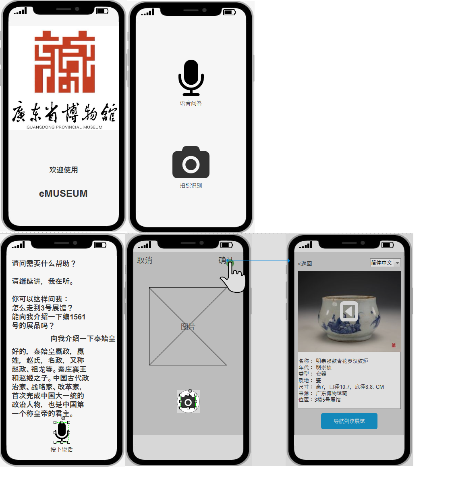

### 一、使用者需求概述
#### 目标用户：来博物馆的游客以及科研人员

#### 加值宣言

本APP（小程序）旨在通过整合各种API，使它们组合起来发挥出更大的作用，进而方便游客解决在参观中遇到的问题。

#### 核心价值

用户使用APP上传展品图片，会自动生成当前位置到该展品的介绍和地图线路。查看展品介绍和地图线路。。 寻找

用户在使用app进行操作到信息内容页面后header部分会有语言栏进行语言选择，用户可以根据自己的需求选择语言，页面会根据选择的语言进行翻译。 翻译

用户打开智能语音交互界面，用语音的形式提出问题，APP会识别用户提出的问题，同时反馈相关的回答内容。 交互

#### 用户痛点：

（1）游客来到博物馆，在欣赏展品时，不想阅读文字。

（2）当外国游客来到博物馆，对馆内的中英文提示都无法理解。

（3）当用户在逛纪念品店，想找到某一款商品同款或相似的商品，不用一件件的看，可使用博物馆app进行图像搜索，找到同样或相似的商品并找到商品相应位置及相关信息。

(4) 游客来到博物馆，但不清楚自己事先想了解的展品位置在哪。

(5) 游客在游览博物馆时，有许多其他游客在看展品说明牌，游客看不到展品说明牌。

#### 人工智能概率性

百度语音合成api技术世界领先
采用领先国际的流式端到端语音语言一体化建模方法，近场中文普通话识别准确率达98%。中文输入法、搜索模型均可在语音自训练平台上零代码自助训练，上传文本语料即可有效提升业务词汇的识别准确率5-25%。 但如果是中英混杂的对话会出现识别不了的情况，此时我们会提醒用户在使用该功能的时候使用全中或全英的语音及尽量控制在60秒内；出现此情况时，用户体验的负面影响压过正面影响的机率较大。

#### 需求列表 优先级：
高–1.图像识别搜索展品，反馈展品方位，使游客迅速到达 2.展品信息的自定义语言翻译

低–1.图像识别搜索展品，显示展品基本信息 2.智能语音交互将语音转为交互 

### 产品原型

* [产品原型预览链接](http://nfunm078.gitee.io/museumrp)

* 

### 二、产品主要概述总结

我们使用阿里的语音交互API及地图API，将展品的介绍以语音形式播放给用户（需要佩戴耳机），更好的分配了游客的听觉和视觉。使游客参观过程中可以不用阅读大量的文字信息，注重在展品本身。同时还具有语音问答功能，用户可以向该软件提问，例如：怎么走到3号展馆？能向我介绍一下编号xxx的展品吗？等等。

APP的云端服务器内储存了该博物馆的所有展品图片及信息，我们利用图像识别API，给用户一个更好的搜索方式。用户有多种方式来找到目标展品，一是基本搜索，在APP现有的数据中搜索，二是对着展品或者展品海报拍照，使用图像识别API来对比数据库内的展品，得出的结果以相似度从高至低排列。从而得知目标展品位置，配合地图API进行语音导航。

整个APP都可以随时调用翻译API，默认语言是手机系统语言，如需要显示默认语言或翻译成其他语言，只需要长按文字就可进行翻译。

#### APP上的体现
用于进入APP主界面，通过点击“展品介绍及寻找”和“智能语音问答”按钮可以实现不同功能：

1.首先点击“展品介绍及寻找”按钮进入对应界面。用户通过上传展品图片来实现“展品介绍和寻找”功能；点击header可实现“翻译”功能。

2.再点击“智能语音问答”按钮，用户进入问答界面，用户可通过发送语音获得信息的形式实现“智能语音问答”的功能。 

### 四、成本效益分析
成本分析：
（1）技术支持成本：包括程序初期开发成本，科研人员聘请成本，BUG修复成本。

（2）维护管理成本：产品还在初级阶段，BUG较多，维修要加大成本投入以及及时对APP进行升级。

（3）风险成本：由于APP处于开放性的网络下，因此APP可能存在着一些安全隐患。以及某些展品信息被盗用

#### 效益分析：
（1）通过图像识别，博物馆能够更好的方便参观者找到自己所想看的文物位置，提供了更好的游览观展体验，给予参观者便利。

（2）通过机器翻译，博物馆能够方便更多外宾了解文物介绍，解决了语言障碍的问题。

（3）通过语音交互，博物馆能够使参观者参与进来，提高博物馆与参观者的互动性，同时也能让外国来宾参与进来。

（4）吸引不同国籍的参观者一起观看，提高博物馆的国际知名度。

（5）通过以上的功能改善，能够极大提高参观者的用户体验，同时提高博物馆的用户评价。

